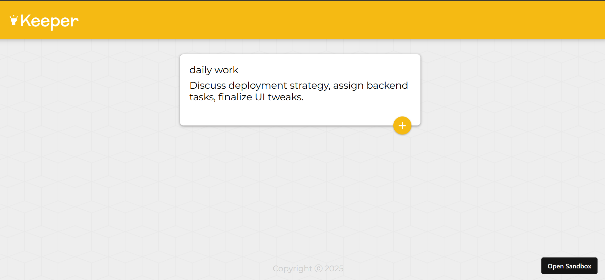

# 📝 Keeper App

A minimalist note-taking web app inspired by Google Keep. Built with React.js, this project demonstrates component-based architecture, dynamic rendering, and clean UI design. Users can add and delete notes in real-time with a smooth user experience.

## 🚀 Features

- Add notes with a title and content
- Delete notes instantly
- Responsive layout using CSS Flexbox/Grid
- Modular React components
- Clean and intuitive UI

## 🛠️ Tech Stack

| Frontend | Description |
|----------|-------------|
| React.js | Functional components, props, hooks |
| HTML5 & CSS3 | Semantic structure and styling |
| JavaScript | Dynamic behavior and logic |
| Google Fonts | Custom typography for aesthetic appeal |

## 📸 Demo Screenshots

Here’s a quick look at the Keeper App in action:

### 🧱 Note Creation Interface

### 🗑️ Note Deletion Feature

### 📱 Responsive Layout

## 🧠 Concepts Practiced

- React component hierarchy and props passing
- State management using `useState`
- Event handling in forms
- JSX syntax and conditional rendering
- CSS styling and layout techniques

📌 Future Improvements
- Add persistent storage using localStorage or backend
- Enable editing of notes
- Add color labels or categories
- Integrate user authentication
- 
🙋‍♂️ About Me
Built by Sahil, a Computer Science undergrad passionate about full-stack development and clean UI/UX. Connect with me on LinkedIn or check out more projects on GitHub.

## 📁 Folder Structure
